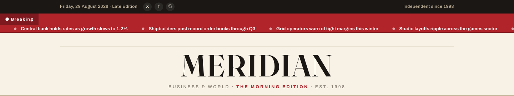

# Business News HTML Template — MERIDIAN

A premium, framework-free HTML/CSS/vanilla-JS template for an independent daily business & world newsroom. Built bespoke from the subject — not a recolored scaffold.

**Live preview:** `index.html` (open in browser)  
**Stack:** HTML5 · CSS3 (custom properties, Grid, Flex) · Vanilla JS (ES modules, no build step)  
**Fonts:** Fraunces (display) · Newsreader (article serif) · Archivo (UI) — all via Google Fonts  
**License:** MIT — use commercially, modify freely.

---

## 📸 Screenshot



## Pages

| Page | Description | Link |
|------|-------------|------|
| **Front Page** | Breaking ticker, masthead, lead story, briefs, feed grid, rail (Most Read + Topics), topic band, newsletter, colophon | [index.html](index.html) |
| **Article** | Full story with drop-cap lede, hero image, pull-stats, blockquotes, inline figures, author bio, related grid, share bar | [article.html](article.html) |
| **Newsroom** | Secure tip line (Signal/PGP), contact emails, location, editorial contact form with inline validation | [contact.html](contact.html) |

---

## Design Distinction

**This template was authored fresh for a news subject and diverges from every sibling template on all 6 divergence axes:**

| Axis | MERIDIAN (this template) | Sibling templates (SOURA, OLIVO, VOSSEN, AERION, KORVA) |
|------|--------------------------|---------------------------------------------------------|
| **Hero composition** | Masthead + live breaking-news ticker (wire-service horizontal scroll). No hero section, no CTA button. | Single centered hero with headline + subhead + primary CTA button. |
| **Layout grammar** | Broadsheet editorial: multi-column feed (main + sticky rail), story grids, feature spans, topic bands, newsletter band. Content density = newspaper. | Section-stack: alternating full-width bands (hero → features → stats → testimonials → CTA → footer). |
| **Typography personality** | **Fraunces** (display, optical sizing) + **Newsreader** (article serif, readable long-form) + **Archivo** (UI, condensed caps). Newspaper voice. | SOURA/OLIVO/VOSSEN/AERION share Fraunces/Playfair/Cormorant/Sora for display + Hanken/Nunito/Jost/DM Sans/Manrope for body. KORVA uses Space Grotesk/Manrope (dark lab). |
| **Color logic** | Newsprint system: warm paper (`--paper`), ink (`--ink`), muted (`--muted`), lines (`--line`), **single kicker-red** (`--accent`) for section labels & live badges. No brand primary/accent/tint ramp. | All siblings use a 3-stop brand ramp: `--primary`, `--primary-600`, `--primary-tint` + `--accent` + full neutral ramp `--n-50…--n-900`. KORVA uses dark lab palette with coral signal. |
| **Motion signature** | **Breaking ticker** — infinite `-50%` translateX loop (duplicated track). **Type-set wipe** — `clip-path: inset(0 0 8% 0) → inset(0)` on scroll reveal. Reduced-motion respected. | Standard fade-up: `opacity:0 → 1` + `translateY(18px) → 0` with cubic-bezier. Same `--ease`/ `--t` tokens across 4 templates. |
| **Section inventory** | Topbar (date/edition) → Ticker → Masthead (rule animation) → Nav (sticky, search, burger) → Lead (1.55fr/1fr) → Briefs → Feed (grid + feature + rail) → Rail (Most Read ranked + Topics tags) → Topic Band (feature + minis) → Newsletter (dark band) → Colophon. Article: drop-cap, pull-stats, blockquote, inline fig, author, related, share. Newsroom: tip line (Signal/PGP), info cols, form. | Hero → Features (3–4 cards) → Stats → Testimonials → CTA → Footer. Article/newsroom pages don't exist in most siblings. |

**Bottom line:** Strip the colors from MERIDIAN and any sibling — they share **zero** layout grammar, component set, or motion vocabulary. This is a newspaper, not a marketing site.

---

## Features

- **Breaking-news ticker** — seamless CSS animation, duplicated track for infinite loop
- **Masthead rule animation** — `scaleX(0→1)` on load
- **Sticky section nav** — Front Page / Business / Markets / Technology / Culture / Opinion / Newsroom
- **Lead story layout** — 1.55fr/1fr grid with Live badge hover scale
- **Briefs rail** — thumbnail + headline + meta, border-separated
- **Story grid** — 2-column responsive, hover lift on thumbnails
- **Feature story** — spans both columns, larger headline
- **Sticky rail** — Most Read (ranked numerals) + Topics (pill tags)
- **Topic band** — alternating feature + mini-lists on warm paper wash
- **Newsletter band** — dark ink background, inline email capture
- **Article page** — drop-cap `::first-letter`, pull-stats grid, blockquote, inline figures, author bio, related grid, share icons
- **Newsroom** — Secure tip line (Signal handle, PGP fingerprint, policy link), contact emails, location, contact form
- **Form validation** — `data-form` with `.form-ok`/`.form-err` inline messages, no `alert()`
- **Mobile drawer** — burger toggles `.nav2 .links.open`, aria-expanded
- **Scroll reveals** — IntersectionObserver, type-set wipe (`clip-path`), staggered delays (`.d1`…`.d4`)
- **Active nav** — auto-highlight via `location.pathname`
- **Footer year** — `[data-year]` auto-fills current year
- **Reduced motion** — `@media (prefers-reduced-motion)` disables all animation
- **Original imagery** — 15 source images from BizNews (`assets/img/`): `news-800x500-[1-3].jpg`, `news-700x435-[1-5].jpg`, `news-110x110-[1-5].jpg`, `ads-728x90.png`, `user.jpg`

---

## Quick Start

```bash
# No install, no build — just open
open index.html
# or serve locally
npx serve .
```

---

## File Structure

```
business-news-html-template/
├── index.html          # Front page
├── article.html        # Article page
├── contact.html        # Newsroom / contact
├── assets/
│   ├── css/
│   │   └── base.css    # Bespoke design system (~650 lines)
│   ├── js/
│   │   └── main.js     # Bespoke interactions (~80 lines)
│   └── img/            # 15 original BizNews images
└── README.md           # This file
```

---

## Customization

- **Colors:** Edit `:root` tokens in `assets/css/base.css` — `--paper`, `--ink`, `--accent` (kicker red), `--live`
- **Fonts:** Swap Google Fonts `<link>` in each HTML `<head>` and update `--font-display/--font-serif/--font-ui`
- **Sections:** Add/remove `.lead`, `.feed`, `.rail`, `.band`, `.newsletter` blocks in `index.html`
- **Articles:** Duplicate `article.html`, change hero image, lede, body copy, related grid
- **Newsroom:** Edit `.tip` channels, `.info-cols` emails/address, form fields

---

## Browser Support

Modern evergreen browsers (Chrome 90+, Firefox 88+, Safari 14+, Edge 90+).  
Graceful degradation: CSS custom properties, Grid, Flex, `clamp()`, `IntersectionObserver` — all polyfillable if needed.

---

## Credits

- **Images:** Original BizNews source assets (included in `assets/img/`)
- **Fonts:** Fraunces (Undercase Type), Newsreader (Production Type), Archivo (Omnibus-Type) — all SIL OFL via Google Fonts
- **Icons:** Inline Unicode (● ◎ ☰ ⌕ 🔒) — no icon font dependency

---

Let's Build Something Together 🚀  
https://tally.so/r/q4q1L9